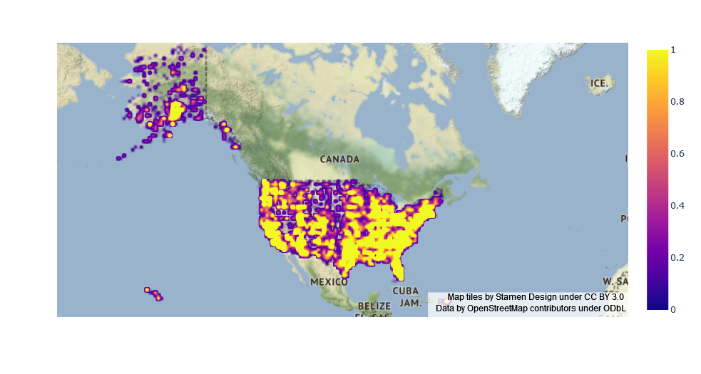
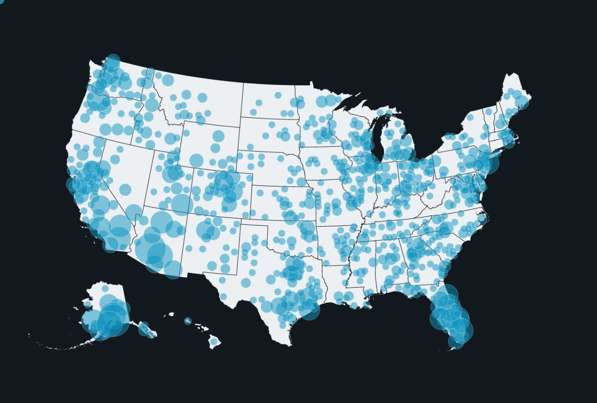
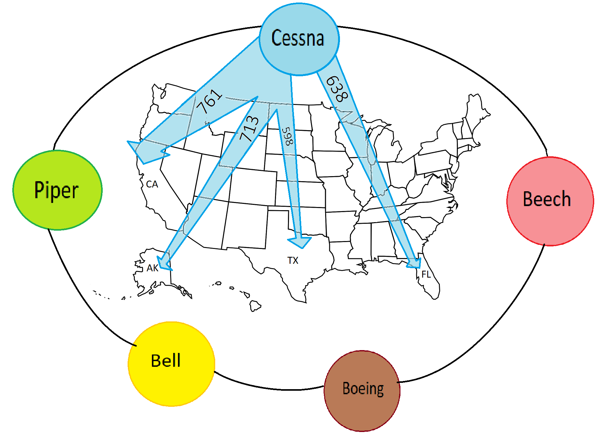

# Project of Data Visualization (COM-480)

| Student's name       | SCIPER |
| -------------------- | ------ |
| Lazar Radojevic      | 351750 |
| Andrija Jelenkovic   | 352089 |
| Aleksa Milisavljevic | 353621 |

[Milestone 1](#milestone-1) • [Milestone 2](#milestone-2) • [Milestone 3](#milestone-3)

## Milestone 1 (7th April, 5pm)

In order to run notebooks, you have to install required libraries

```
$ pip install -r requirements.txt
```

### Dataset

We will be visualizing the NTSB aviation accident database from the [Kaggle](https://www.kaggle.com/datasets/khsamaha/aviation-accident-database-synopses?select=AviationData.csv). As stated there, "it contains information from 1962 and later about civil aviation accidents and selected incidents within the United States, its territories and possessions, and in international waters".

NTSB is an acronym for the National Transportation Safety Board, a federal agency in the United States that is responsible for investigating civil transportation accidents. They aim to uncover the cause of incidents and accidents and issue safety recommendations to prevent them from happening again. As of 2014, they have issued as many as 14,000 safety recommendations. This database, therefore, provides one of the most relevant sources of information for anyone aspiring to delve into the topic of aviation accidents.

### Problematic

Our main goal is to create an interactive map that allows users to explore the location and causes of aviation accidents in the United States and around the world.

#### Motivation

Statistical data is often presented tediously, encumbered with details that prevent any real understanding of the topic. Our goal is to present the raw information extracted from the NTSB dataset in an interesting and meaningful way, one that could inform people about the history of aviation and its evolution throughout the previous 50 years. For example, by plotting the number of accidents per year, one could visually observe the improvement in airplane safety. This fact is often overlooked by the media chasing the big headline after a major tragedy occurs.

#### Overview

By analyzing this dataset and mapping out the location and frequency of accidents over time, we aim to show the safety trends in the aviation industry. The interactive map will help us to visualize these trends in the way that is the most accessible to the general public. Alongside them, the project would encompass relevant information about some of the most impactful airplane accidents.

#### Target audience

This project aims to sparkle interest in the history of aviation crashes among the members of the general public. Besides them, this project could also prove useful for aviation safety experts, educators, researchers, policymakers, and anyone else who wants to find out more about the topic.

### Exploratory Data Analysis

You can see deails of data analysis we did in the notebook titled `src/data_exploration.ipynb`. Within this notebook, we have provided a detailed analysis of the aviation accident dataset, including several visualizations. One of these visualizations demonstrates that the number of plane crashes has decreased over time, suggesting an improvement in aviation safety.


Additionally, we have included a heatmap visualization displaying the distribution of crashes since 1982, which reveals distinct territorial patterns. These findings highlight the importance of continued efforts to improve aviation safety and provide insights into potential areas for improvement.



### Related work

As the dataset is avaliable on the Kaggle, various scientists and enthusiasts have uploaded their notebooks as part of their data analysis. All of them are available [here](https://www.kaggle.com/datasets/khsamaha/aviation-accident-database-synopses/code?select=AviationData.csv). Some of the most interesting can be found [here](https://www.kaggle.com/code/aqsasadaf/aviation-accident-database-beginners-analysis), [here](https://www.kaggle.com/code/khsamaha/ntsb-us-aviation-accident-up-to-jan-2022) and [here](https://www.kaggle.com/code/weichonggg/team-quby).

Our approach to analyzing the aviation accident dataset differs from previous studies in several ways. Firstly, we enriched the dataset by extracting the cause of each accident from the textual description. This additional information provides valuable insights into the factors contributing to each incident. Secondly, we verified that the coordinates of each crash correspond to the state reported in the incident report, ensuring the accuracy of our spatial analysis. Furthermore, we will be presenting our analysis on an interactive map, allowing users to easily explore trends over time, regional patterns, and other potential patterns of interest. This interactive approach offers a user-friendly way to visualize and explore complex data.

One of the inspirations for our work is the website [flightradar24](https://www.flightradar24.com/). It is a popular flight tracking service that provides real-time flight tracking information for aircraft around the world. Users can interactively access information about aircraft's location, altitude, speed, and flight path.

Another great interactive site is [flightconnections](https://www.flightconnections.com/). FlightConnections is a website that provides a list of direct flight connections between airports around the world. The website allows users to search for flights by selecting a departure airport and destination airport on the map. It displays a list of all the direct flights available between those two locations, along with information on airlines, flight times, and frequency of service.

## Milestone 2 (7th May, 5pm)

You can see our report for the Milestone 2 in the .pdf format [here](./data/reports/milestone2.pdf). The current version of our website is [here](https://datavis-m2.jelenkovic.xyz).

### Visualization Ideas

We intend to present the dataset using three main visualizations:

1. Using an interactive map of the United States, we want to show the density of plane crashes per state. In the data analysis for the first milestone, we have noticed that this number varies greatly across different states. For example, California, Texas, and Florida have significantly more crashes, than the majority of other states. The first sketch of this is below:



We aim to make this map interactive, by enabling users to select the period during which the
accidents happened.

2. Afterwards, we would like to illustrate the evolution of aviation. This visualization would show temporal trends in aviation, by plotting a number of crashes on a spiral. This type of illustration is called **’condegram’**. Every 360 degrees of the spiral would contain data of 5-15 years, divided on a monthly basis while utilizing different colors. For example, as observed in the data analysis of the first milestone, we notice an overall decrease in the number of crashes. Because the data is divided on a monthly basis, this visualization would also illustrate the frequency of plane crashes through different seasons of the year:


We were inspired by Kirel Benzi’s Circadian Rhythm.

3. For our final visualization, we aim to show the mapping between the plane models and the U.S. states in which they crashed. We would position the most popular plane models on a circle surrounding a map of the U.S. Each plane model would be connected to the states by the line, the thickness of which would depend on the number of crashes in the given state.



### Tools and Lectures

This work is heavily inspired by **Lecture 1: Introduction to Data Visualization** (and in particular the work of Kirell Benzi) and **Lecture 8: Maps**. We wanted to make this as simple and fast as possible and that is why, apart from **D3.js** we are using three more packages:

- **TopoJSON**: an extension of GeoJSON that encodes topology which is needed for drawing maps. Its advantage over other formats is that it is very compact so it can be loaded pretty fast.
- **Pico CSS**: a simple class-less CSS library suitable for quickly making website prototypes.
- **Vite**: a state of the arc build tool for bundling JS files with sane defaults.

### Goals and Additional Work

The three described visualizations are the main focus of the project. We intend to work on them independently. As additional work, we list the following enhancements for these visualizations:

- As an enhancement to the first visualization, we are considering adding more filters or sliders. These would include filtering by the phase of flight during which the plane crashed, the number of wounded or mortally wounded in those crashes, etc. We aim to include interactivity in this visualization as well. Hovering or clicking on particular crashes could show some descriptive statistics for that region.
- We are thinking about making the second visualization more descriptive, by adding the information about the most fatal crash in the given month. When a user clicks on a particular month, we would write this information in the center of the circle and also present the report status, if available from the dataset.

## Milestone 3 (4th June, 5pm)

**80% of the final grade**

## Late policy

- < 24h: 80% of the grade for the milestone
- < 48h: 70% of the grade for the milestone
