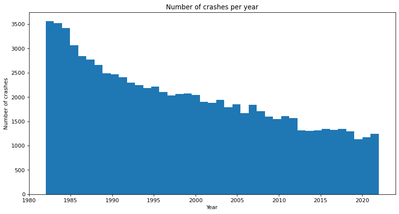

# Project of Data Visualization (COM-480)

| Student's name | SCIPER |
| -------------- | ------ |
| | |
| | |
| | |

[Milestone 1](#milestone-1) • [Milestone 2](#milestone-2) • [Milestone 3](#milestone-3)

## Milestone 1 (7th April, 5pm)

**10% of the final grade**

This is a preliminary milestone to let you set up goals for your final project and assess the feasibility of your ideas.
Please, fill the following sections about your project.

*(max. 2000 characters per section)*

### Dataset

We will be visualizing the NTSB aviation accident database from the [Kaggle](https://www.kaggle.com/datasets/khsamaha/aviation-accident-database-synopses?select=AviationData.csv). As stated there, "it contains information from 1962 and later about civil aviation accidents and selected incidents within the United States, its territories and possessions, and in international waters".

The NTSB is a federal agency in the United States that is responsible for investigating civil aviation accidents and incidents, as well as accidents and incidents involving other modes of transportation. Their goal is to identify the cause of accidents and make recommendations to prevent similar accidents from happening in the future. The NTSB aviation accident database is an important tool for researchers, investigators, and others who are interested in studying aviation safety and learning from past incidents to improve safety in the future.

### Problematic

One particularly interesting way to explore this dataset is to map out the location and frequency of plane crashes over time. By creating a time-lapse map of aviation accidents, it is possible to see how the frequency and severity of accidents has changed over the years, as well as to identify any geographic or temporal patterns in the data. Overall, mapping out aviation accidents through time can be a powerful tool for understanding the history of aviation safety and identifying ways to improve it in the future.

#### Overview:
By analyzing this dataset and mapping out the location and frequency of accidents over time, we can gain a better understanding of the safety trends in the aviation industry. Furthermore, by identifying the causes of these accidents, we can work to improve safety measures and prevent future incidents. Our goal is to create an interactive map that allows users to explore the location and causes of aviation accidents in the United States and around the world. 

#### Motivation:
The motivation for this project is to gain insights into the patterns and trends of aviation accidents over time and to identify areas of concern that can be addressed to improve aviation safety. By mapping out the location and frequency of plane crashes, it will be possible to see how accidents have changed over the years and to identify any trends or patterns that may have contributed to the accidents. By including information about the cause of each crash, we hope to raise awareness about the importance of aviation safety and to promote ongoing efforts to improve safety measures in the industry.

#### Target Audience:
The target audience for this project includes aviation safety experts, researchers, policymakers, and anyone who is interested in understanding the history of aviation safety and identifying ways to improve it in the future. This project could be particularly useful for policymakers and aviation safety experts who are looking to prioritize safety measures and identify areas of concern to prevent future accidents. Additionally, this project could be of interest to the general public who may be interested in learning more about the history of aviation safety and the ways in which accidents have changed over time.

### Exploratory Data Analysis

You can see deails of data analysis we did in the notebook titled `src/data_exploration.ipynb`. Within this notebook, we have provided a detailed analysis of the aviation accident dataset, including several visualizations. One of these visualizations demonstrates that the number of plane crashes has decreased over time, suggesting an improvement in aviation safety.

Additionally, we have included a heatmap visualization displaying the distribution of crashes since 1982, which reveals distinct territorial patterns. These findings highlight the importance of continued efforts to improve aviation safety and provide insights into potential areas for improvement.

### Related work

As the dataset is avaliable on the Kaggle, people upload their notebooks as part of their data analysis. All of them are available [here](https://www.kaggle.com/datasets/khsamaha/aviation-accident-database-synopses/code?select=AviationData.csv). Some of the best and most upvoted ones can be found [here](https://www.kaggle.com/code/aqsasadaf/aviation-accident-database-beginners-analysis), [here](https://www.kaggle.com/code/khsamaha/ntsb-us-aviation-accident-up-to-jan-2022) and [here](https://www.kaggle.com/code/weichonggg/team-quby).

Our approach to analyzing the aviation accident dataset differs from previous studies in several ways. Firstly, we enriched the dataset by extracting the cause of each accident from the textual description. This additional information provides valuable insights into the factors contributing to each incident. Secondly, we verified that the coordinates of each crash correspond to the state reported in the incident report, ensuring the accuracy of our spatial analysis. Furthermore, we will be presenting our analysis on an interactive map, allowing users to easily explore trends over time, regional patterns, and other potential patterns of interest. This interactive approach offers a user-friendly way to visualize and explore complex data.

One of the inspirations for our work is the website (flightradar24)[https://www.flightradar24.com/]. It is a popular flight tracking service that provides real-time flight tracking information for aircraft around the world. Users can interactively access information about aircraft's location, altitude, speed, and flight path. 

Another great interactive site is (flightconnections)[https://www.flightconnections.com/]. FlightConnections is a website that provides a list of direct flight connections between airports around the world. The website allows users to search for flights by selecting a departure airport and destination airport on the map. It displays a list of all the direct flights available between those two locations, along with information on airlines, flight times, and frequency of service.

## Milestone 2 (7th May, 5pm)

**10% of the final grade**

## Milestone 3 (4th June, 5pm)

**80% of the final grade**

## Late policy

- < 24h: 80% of the grade for the milestone
- < 48h: 70% of the grade for the milestone

